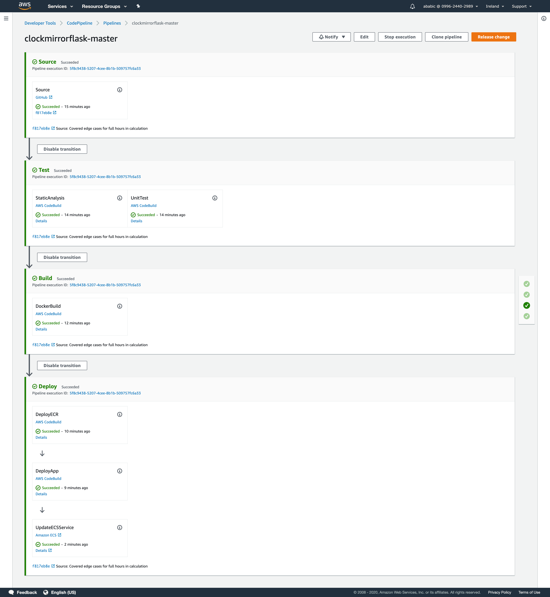

# Clock Mirror mystery solver API

# What's this?

This is simple flask API that solves following coding challenge:

```
Peter can see a clock in the mirror from the place he sits in the office.
When he saw the clock shows 12:22. 
He knows that the time is 11:38

In the same manner:

05:25 --> 06:35

01:50 --> 10:10

11:58 --> 12:02

12:01 --> 11:59

Please create an application which solves the problem. 

Return the real time as a string.

Consider hours to be between 1 <= hour < 13.

So there is no 00:20, instead it is 12:20.

There is no 13:20, instead it is 01:20.
```


Purpose of this repository is to showcase full CICD -> ECS IaC flow, actual 'problem' that we are solving is just a side story, of course.

# Live demo
~~The API is live at [http://clockmirrorflask-master-1509826507.eu-west-1.elb.amazonaws.com/](http://clockmirrorflask-master-1509826507.eu-west-1.elb.amazonaws.com/).~~ (resources destroyed at the moment)


# Directory structure
* [src](src) - contains the API source code
* [tests](tests) - contains unit tests
* [.infra/app](.infra/app) - contains api related terraform
* [.infra/ecr](.infra/ecr) - contains ecr related terraform
* [.infra/cicd](.infra/cicd) - contains CI/CD related terraform

## Running the API with Docker

The API is consumable as a Docker image.

```shell script
docker build -t clockmirror .
docker run --rm -p 8080:8080 clockmirror
```
> Swagger UI is available on http://127.0.0.1:8080

## Running the API without Docker

```shell script
# Assuming that you have python3 and pipenv installed
pipenv install
pipenv run python src/app.py
```

## Running Unit Tests (pytest)
```shell script
# Assuming that you have python3 and pipenv installed
pipenv install --dev
pipenv run pytest
```

## Usage example
Once the API is up and running, you can check the Swagger documentation on `http://127.0.0.1:8080`

GET /clock endpoint example:
```shell script
curl http://127.0.0.1:8080/clock\?mirror_time\=12:22               
                                                                     
{"mirror_time": "12:22", "actual_time": "11:38"}

```

# Infrastructure

This API runs in a completely serverless environment utilizing Amazon ECS with Fargate.
  
Docker image is persisted in Amazon ECR.
  
CI/CD is handled using AWS CodePipeline and AWS Codebuild.

## Dockerfile
Dockerfile is using `python:3.8-slim` as base image, installing system/app dependencies, creating non-privileged user and finally, running the API using `waitress` server.

## CI/CD
API will automatically be built and deployed for each commit on selected branch(`master` by default).

The pipeline has following stages:

* Source
* Test
    * Static Analysis
    * Unit Test
* Build
* Deploy
    * DeployECR
    * DeployApp
    * UpdateECSService



#### Source stage
Source stage is triggered whenever a new commit is pushed to the observed remote branch.
  
Source is stored on the S3 bucket.

#### Test stage

First thing we do is check all components using static analysis
approach.

* Terraform files are tested using the `fmt` and `validate` built-in tf
  commands
* Python files are tested using `flake8`

At the same time, in parallel, we are running unit tests using `pytest`.

If either of actions fail, whole stage fails.

#### Build stage

Once testing was successful, we build the container with Docker
daemon, save image to the file (`docker save` command) and mark it as
a build artifact.

#### Deploy stage

Finally, once increment is tested and built we need to deploy it. This
stage has 2 actions:

* DeployECR
    * Run Terraform to create/modify ECR repository
    * Load built image and push it to the ECR repository (with 2 tags, current commit hash and `latest`)
* DeployApp
    * Run Terraform to create/modify API resources
* UpdateECSService
    * Use `Amazon ECS` Deploy provider to update ECS service with latest tasks

# Deployment into AWS Environment
In order to deploy the API (including CICD) in the AWS environment, you have to apply CICD terraform from the local machine for the first time, after that CodePipeline will observe the repository and deploy whenever new commit is pushed to the remote origin.
  
Current implementation assumes that you will use S3 as a remote Terraform state and already have the bucket created.

### Deployment steps
```shell script
cd .infra/cicd

export GITHUB_TOKEN=<super-secure-token>

# I'm using eu-west-1, and all modules are defaulting to this region, it can be changed if needed
terraform init -backend-config="bucket=<tf-state-bucket-name>" -backend-config="region=eu-west-1"

# `env` is used as a suffix to resource names, for example `master`
# `tf_state_bucket` is name of the bucket that will be used to manage remote tf state
terraform apply -var 'env=<env_name>' -var 'tf_state_bucket=<bucket_name>'
```
> `GITHUB_TOKEN` is required (as per terraform documentation) when using `GitHub` as CodePipeline source, it's enough to give it only `public:repo` access.
  
> Utilizing terraform workspaces is a good idea if you plan on deploying multiple CICD instances in the same account.

Once `terraform apply` is done, the pipeline will be triggered automatically.
  
API Url is shown in `DeployApp` action outputs.

### Possible improvements
I've limited scope of this project because purpose of this was just to showcase whole CICD -> ECS flow, but some of the improvements I would like to add in the future are:
* Implement semver releases
* Implement TF variables configuration manager store overrides (secrets manager/parameter store)
* Use non-default VPC in ECS
* Add auto-scaling in the ECS
* Add other angles of testing (integration, smoke, e2e)
* Add pytest coverage
